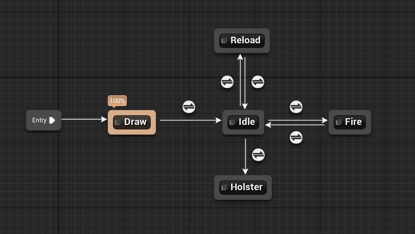

# Animation - MP5 Submachine Gun

Blueprints can be viewed through the links below.

I have animated premade assets (the arms and gun) in Blender, imported them into Unreal Engine 4, and created a prototype first-person animation system. I was aiming to create something that would fit a semi-realistic, casual shooter. My main focus was on the animation, but I also did some work on audio effects for a more immersive experience.

The animation blueprint includes five states: Draw, Idle, Fire, Reload, and Holster. The sounds are triggered by the animations through anim notifies. The shells are physics-driven and controlled through the character blueprint.

In future gun-related projects I would like to focus more on how firing the gun feels - especially firing it continuously. A more complex animation system is needed, where the longer the trigger is pulled, the closer the gun comes to the camera and the longer it takes for the character's hands to return to their idle position. Some randomness in how the gun kicks back could help too. Additionally, a premade shooting audio loop could sound much better than the one-sound loop that I have used.

Character blueprint: https://blueprintue.com/blueprint/vinn2n9o/
Animation blueprint: https://blueprintue.com/blueprint/td8qtei_/

Assets used:
https://www.mediafire.com/file/g9591o141vos6x3/mini_multi-rig_v4.zip/file
https://free3d.com/3d-model/mp5k-fully-rigged-60158.html
https://free3d.com/3d-model/bullet-shell-9mm-pistol-67714.html
https://www.fesliyanstudios.com/royalty-free-sound-effects-download/gun-shooting-300
https://www.youtube.com/watch?v=bD_teL6YREY
https://www.videvo.net/sound-effect/very-bright-pistol-co-pe406302/260768/
Several sound effects from Zapsplat.com

https://youtu.be/jRLJXq0hAGI

Animation State Machine