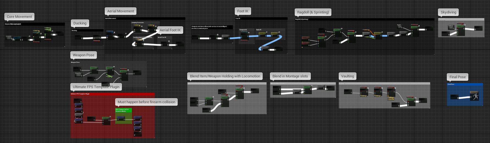

# Animation Improvements - MORTARMEN

https://youtu.be/zmRtFmTxdho

I was tasked with improving the animations for Crouch Jump Interactive's upcoming title - MORTARMEN. I used Unreal Engine and Blender to modify existing animations, create new ones, and work on the transitions using animation blueprints.

The character's animation blueprint. I didn't create most of it; but I did spend a lot of time on making adjustments to the different parts of the BP, modifying and adding logic, adjusting blends, etc.

[animbp.mp4](animbp.mp4)

The locomotion state machine runs deep. I've spent a lot of time on modifying the transition rules and changing some of the logic