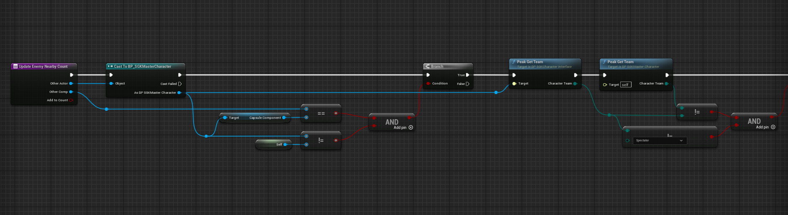
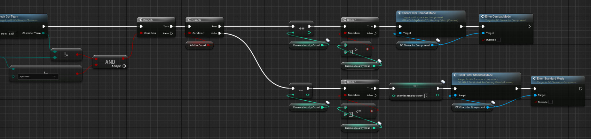

# Animation Improvements - PEAK.53

I was hired by the PEAK.53 team to implement new mocap animations, create new blend spaces, and make some improvements to the IK and animation blueprints. I also implemented a system which raises the player's gun when enemies are nearby. Here are some clips of how the animations looked before and after my changes.

Music used in video: Matrix by Blackscorpionmusic from Pixabay

https://youtu.be/5p13lhBthEM

[blendspaceriflecompressed.mp4](blendspaceriflecompressed.mp4)

New locomotion blend space

Blueprint snippet used to determine whether there are enemies nearby and the gun should be raised

Blueprint snippet used to determine whether there are enemies nearby and the gun should be raised