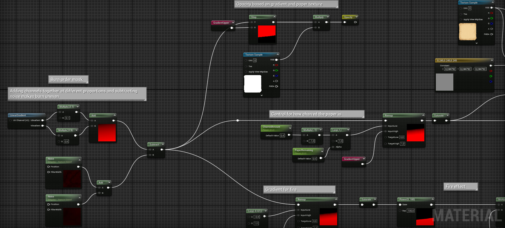
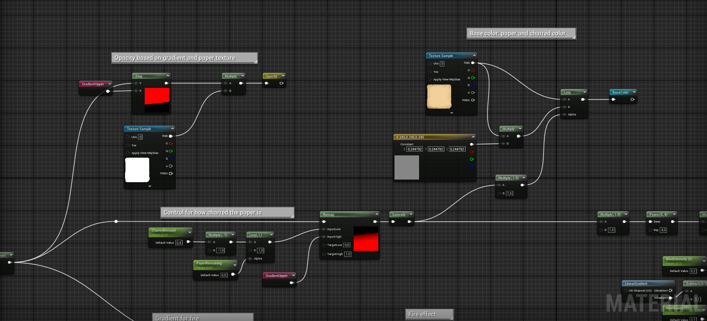
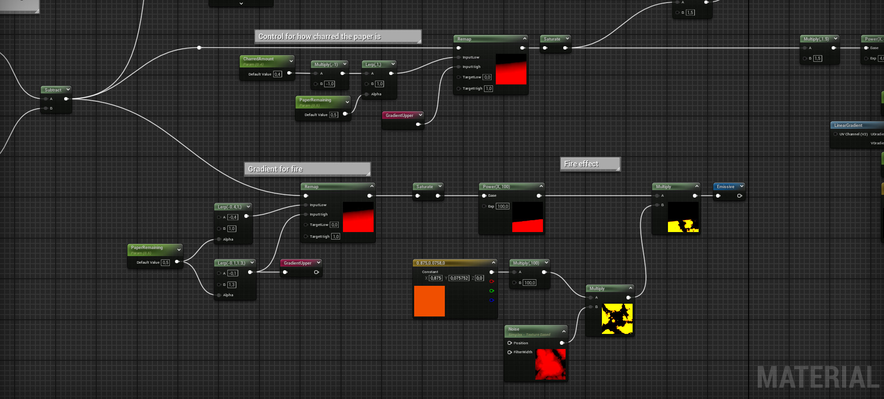
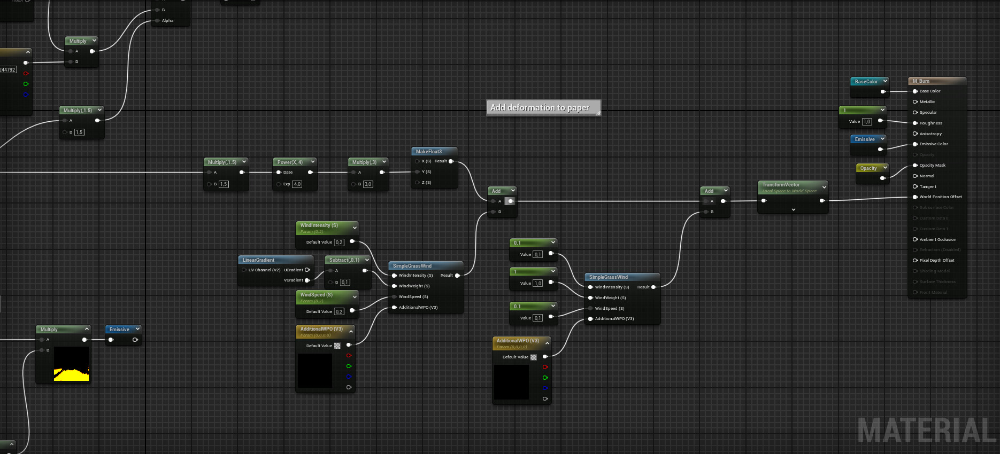
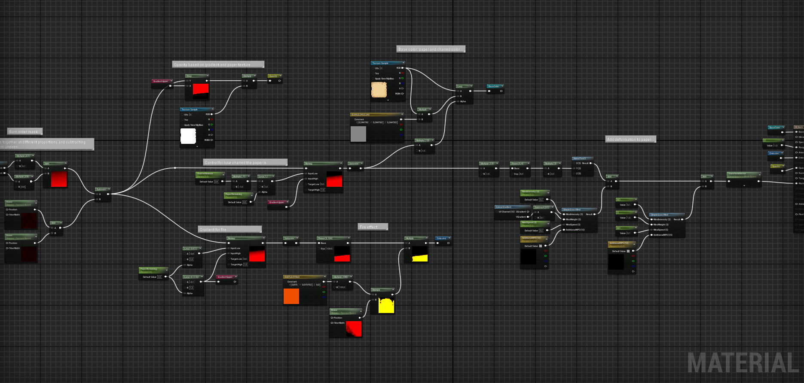
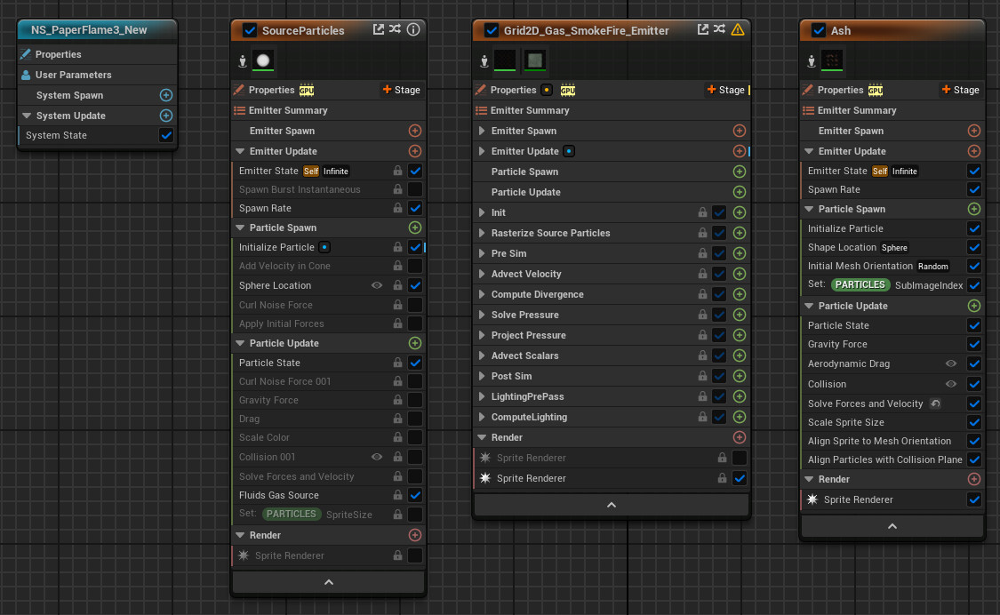

# Burning Paper

Personal project, experimenting with Niagara's Fluid simulation, in this case used to create realistic fire. It runs in realtime at 80 FPS (12 ms) on a 6700M (equivalent to something between a 3060/3070) on the Epic setting. The Niagara effects (flame and ash) cost around 1 ms. The fire, ash and paper burning material is my work. All other assets are either from Quixel or downloaded from the internet.

Old Paper Texture by Playingwithbrushes: https://www.flickr.com/photos/playingwithpsp/2546732241/

https://youtu.be/8t7BuvQqJkw

Paper material setup

Niagara System (based on the "Grid 2D Gas Moving Fire" template)