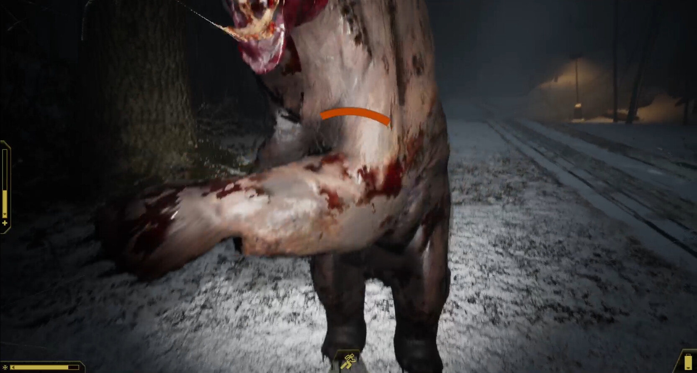
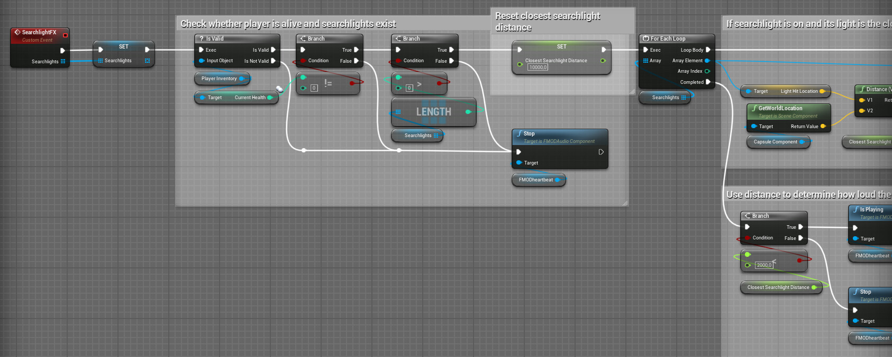

# Expedition Zero Immersion

I was asked to improve the immersion and overall "feel" of Expedition Zero - a horror survival game by Enigmatic Machines.

My work here mainly consisted of implementing screen effects, camera movements/shakes and provided sound effects to convey the misery the character is going through - cold, violence, poison gas, you name it.

I've used Chameleon Post Process to implement many of the effects.

https://youtu.be/DeoK3AIPG_0

Cold effects: frost and shivering. The character also breathes a sigh of relief when the temperature reaches a comfortable level (hard to hear due to the storm)

https://youtu.be/sFeGo-RAtzY

Head movement added through camera shakes to make the rifle more satisfying to shoot

https://youtu.be/81r_LUDVIPA

Water: screen and particle effects + color correction

https://youtu.be/V3uKsJHdlNI

Low health and stamina screen and camera shake effects

https://youtu.be/a2s3EnSx6yU

Walking and sprinting head movement. Notice the up-and-down motion when the player is breathing heavily. Head bob amount can be adjusted or disabled in settings

https://youtu.be/0yEtjhcKJ7I

Gas poisoning screen effects

https://youtu.be/EiFV65oQ2X8

Ghost screen effects

https://youtu.be/yqum3V_PHvQ

Sleeping sequence

https://youtu.be/oC8L3kY8sgI

Heartbeat effect when near searchlights and blood effects when shot

https://youtu.be/MgJbggDy-6U

Camera shake on getting hit

https://youtu.be/tT2uzOL1Fnw

Noise effects when a monster is near

https://youtu.be/dZkFF_am4F8

I've worked on the monster's tongue attack throwing motion to make it feel more impactful

There's a chance of the visor cracking when getting hit

Searchlight heartbeat effect blueprint

Searchlight heartbeat effect blueprint, continued