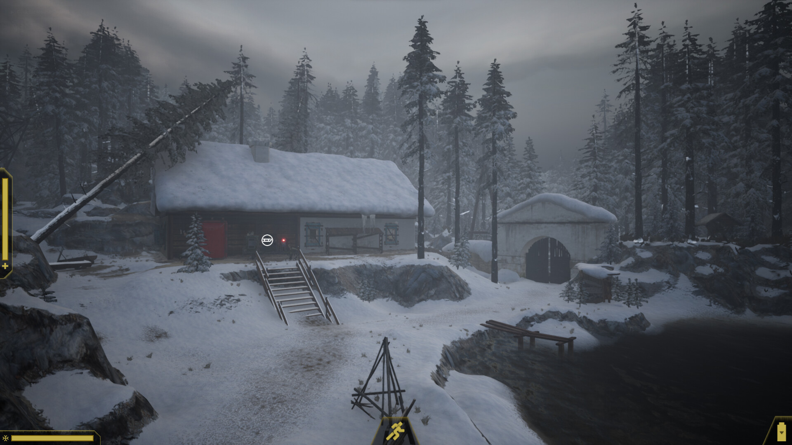
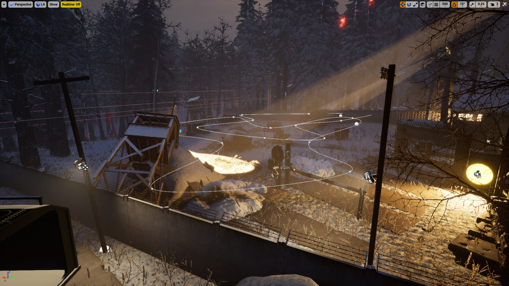

# Expedition Zero Miscellaneous

I've done some work for Enigmatic Machine's survival horror game - Expedition Zero - that doesn't quite fit anywhere else in my portfolio. So I'll just put it here.

https://youtu.be/JbhU3_yYMH4

Camera work for the final scene of the game (starting from 1:05) + end credits UI

https://youtu.be/a49P7qj9Hq4

Camera work for the intro sequence

Did some work on the first level of the game: helped place snow, earth and grass materials where appropriate, modified the placement of trees, covered visible areas where the player could see the map ending, and modified the lighting to set the mood

Touched-up the second map as well, e.g. by setting up walls to restrict the player in their path through the searchlights

https://youtu.be/xJCmeOvirmE

Built the main menu scene out of available assets