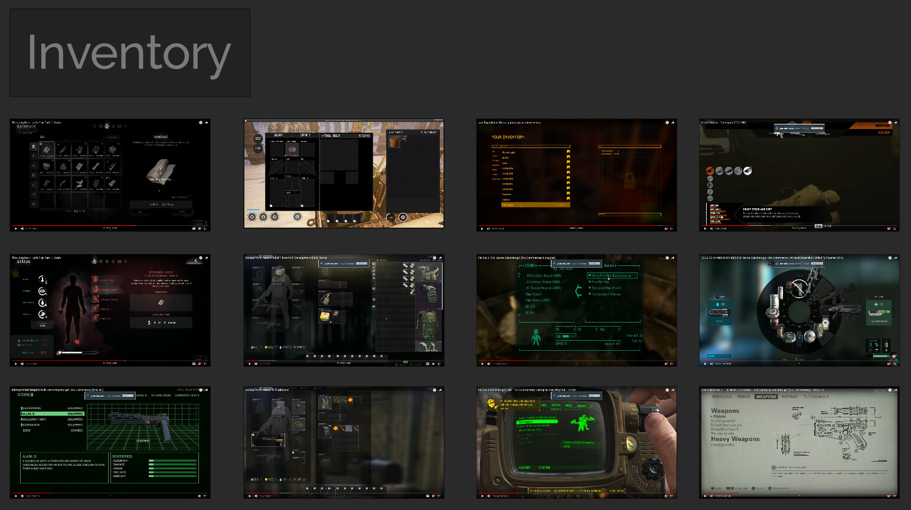

# Expedition Zero UI

I was responsible for the art direction and design of the majority of the UI elements in Expedition Zero - a survival horror game by Enigmatic Machines.

My main inspiration were retro-futuristic interfaces, such as those found in the Alien universe. I wanted to give the UI a bit of an "old CRT" feel.

Many UI elements are based on Survival Game Kit V2, which were modified and redesigned to fit the game better. While I can't take credit for most of the UI implementation, I have created/modified numerous blueprints to make things work. The equipment items icons are also not my work.

https://youtu.be/xJCmeOvirmE

Main menu. Notice the subtle flicker behind the green buttons (a little hard to see due to compression)

Main HUD

Equipment HUD

[tutorial2.mp4](tutorial2.mp4)

The tutorial is dynamic, adapting to many player actions. Also notice the subtle animation when opening the map. I added it to give the UI more of an "old CRT" feel

[tutorialmousetogamepad2.mp4](tutorialmousetogamepad2.mp4)

The tutorial dynamically switches between game pad and keyboard & mouse use

https://youtu.be/MgJbggDy-6U

Damage indicator and death screen

https://youtu.be/0yEtjhcKJ7I

Gas indicator

https://youtu.be/Hjk1eeS_GeM

"Data transfer" progress bar

Forest level map

Map used for traveling between locations

https://youtu.be/NK3WQK-I6_E

Optional context sensitivity for a more minimal UI. The icons will only appear when the stat is low, rapidly depleting, etc.

Inventory

Crafting menu

Objectives

Some of the icons created for the game

Early HUD concept

Early HUD concept

Early HUD concept

Early HUD concept

UI references

UI references

UI references

Blueprint implementing the progress bar

Blueprint implementing the progress bar, continued

Part of the blueprint implementing context sensitivity