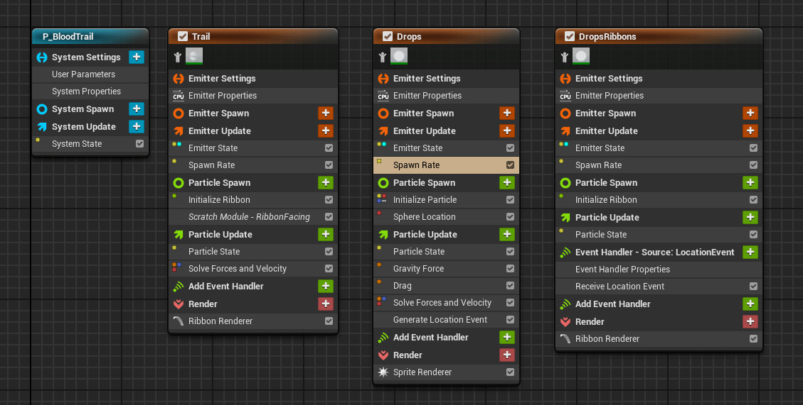
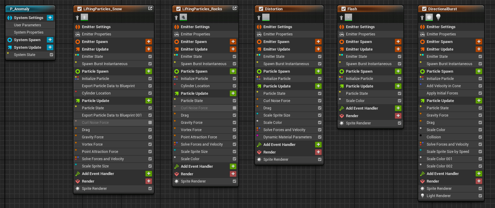
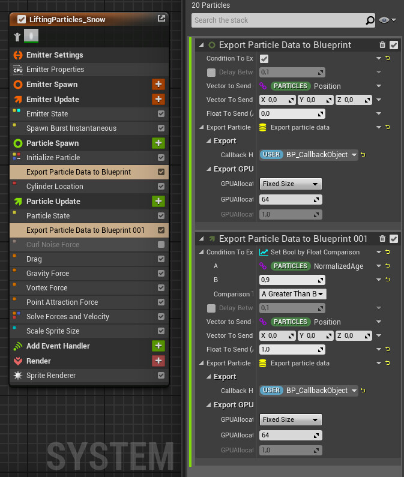
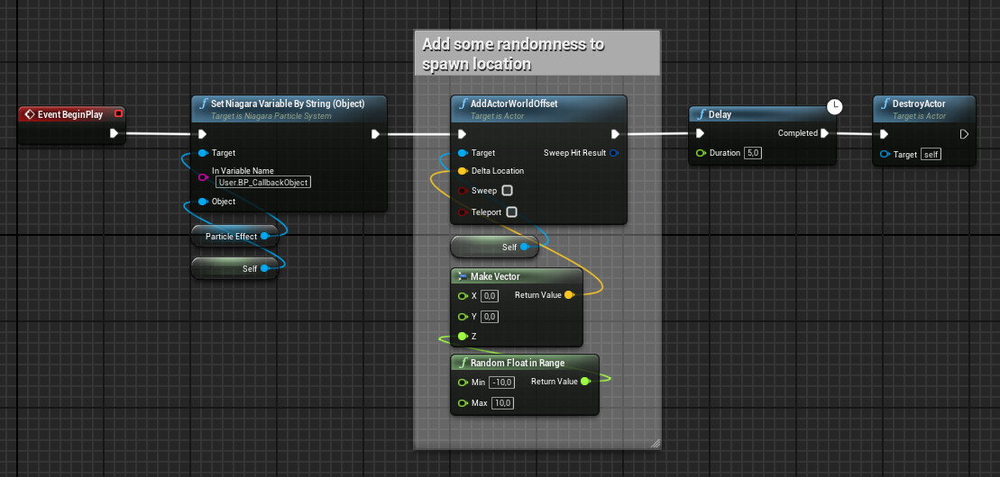
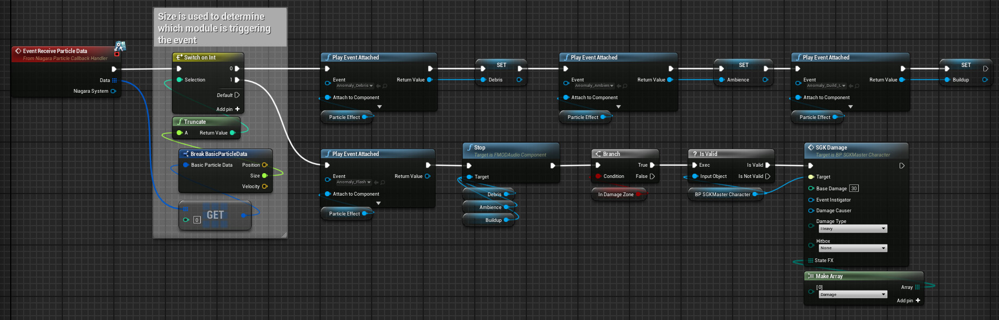
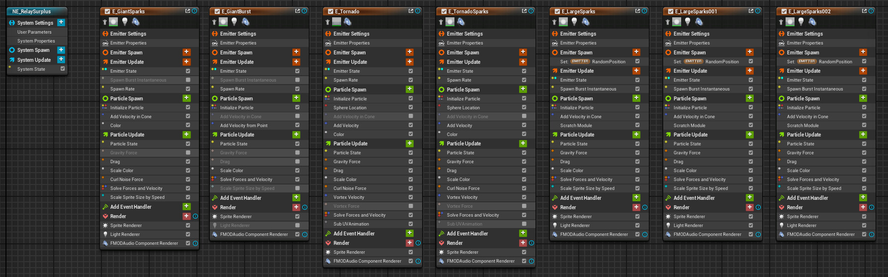
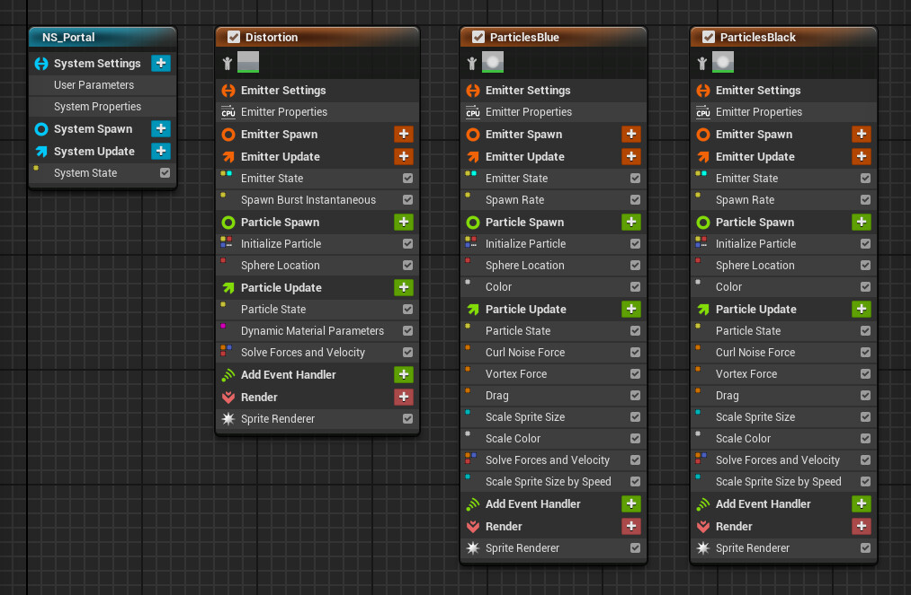
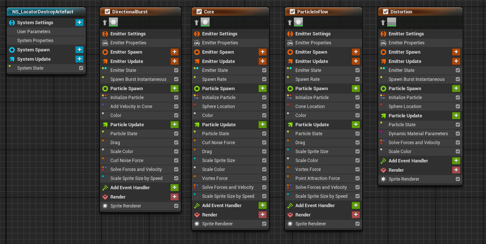

# Expedition Zero VFX

I've had the opportunity to create and implement the visual part of a bunch of effects while working on Expedition Zero - a horror survival game by Enigmatic Machines. Here are some examples

https://youtu.be/1ij5Htx7lLA

"Anomaly" particle effect. Includes a system for spawning them randomly within an area

[anomalyineditor2.mp4](anomalyineditor2.mp4)

https://youtu.be/tT2uzOL1Fnw

Bark particles fall when the monster jumps between trees. Bugs escape its body when shot. I've also added the blood particles and textures to its "finishers"

[strigoiattackineditor2.mp4](strigoiattackineditor2.mp4)

Blood particle system used for the first "finisher". Unfortunately, it's a little hard to see in-game due to how dark it is

https://youtu.be/sprlnYSEGX4

[tornadoineditor2.mp4](tornadoineditor2.mp4)

https://youtu.be/gHuVpWwfs5o

[portalineditor2.mp4](portalineditor2.mp4)

https://youtu.be/eTBZOgY8MaI

[locatoreffectineditor2.mp4](locatoreffectineditor2.mp4)

Monster "finisher" particle system

"Anomaly" particle system

I've used callbacks to increase the flexibility when creating sounds for the effect. The project used FMOD, which only had early experimental support for Niagara, so I've used this as a stable workaround. See blueprints below for the implementation

"Anomaly" blueprint

"Anomaly" blueprint, continued. The event is used to control when FMOD events should start and stop and to deal damage to the play at the right moment (if he's close enough to the anomaly)

"Tornado" particle system

"Portal" particle system

"Infection" destruction particle system