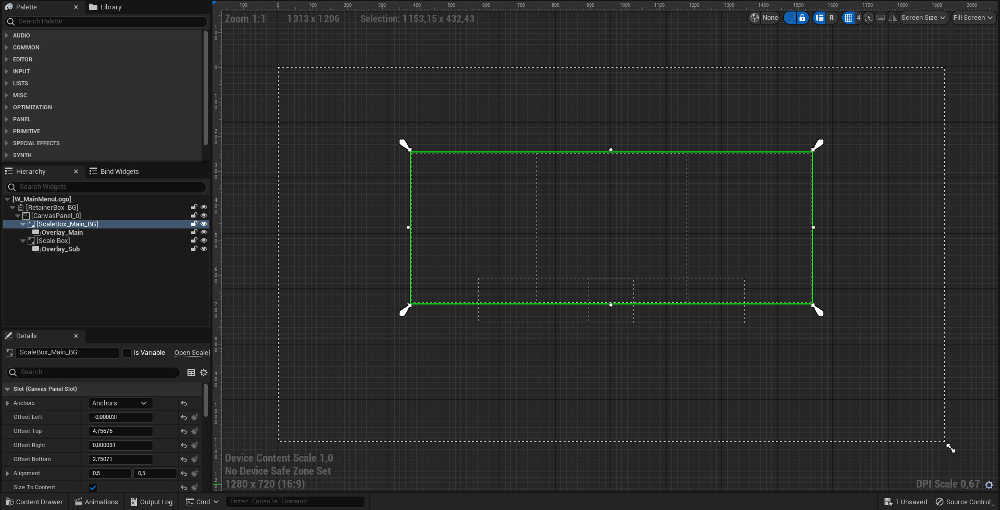
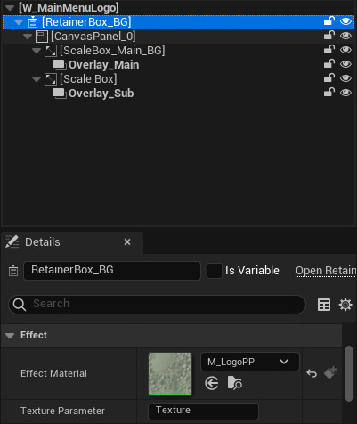
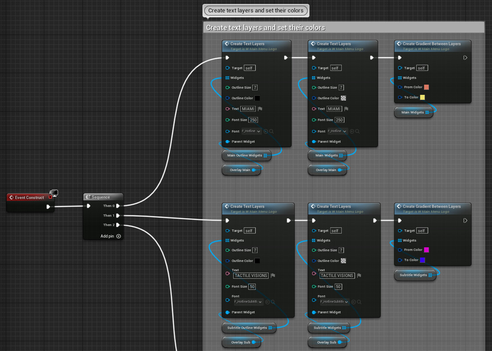
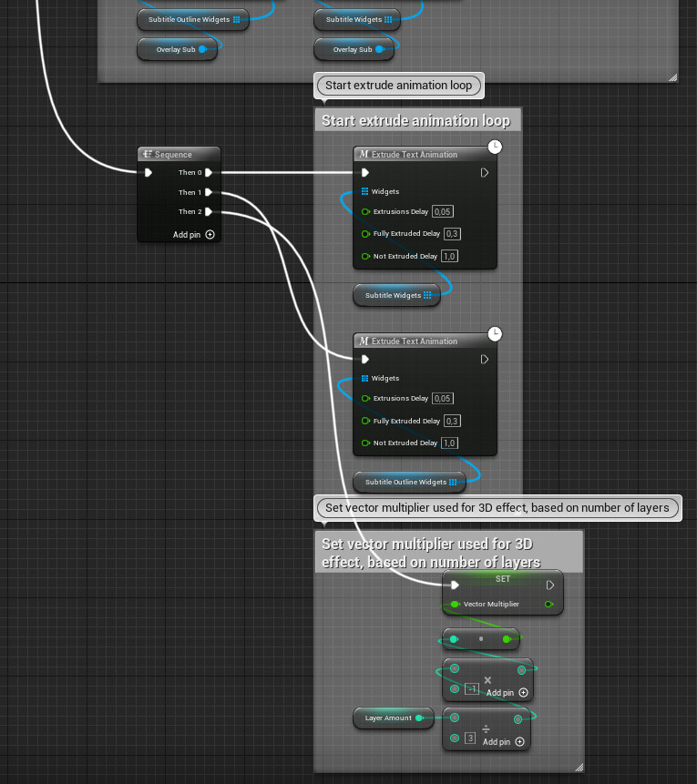
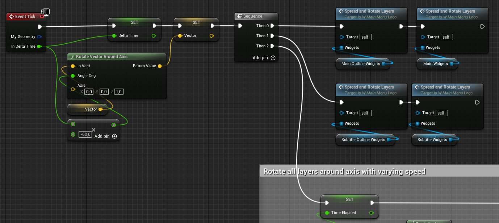
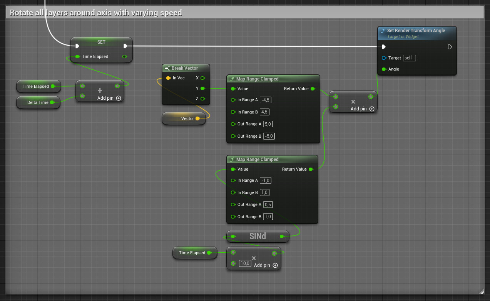
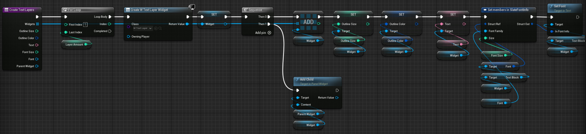
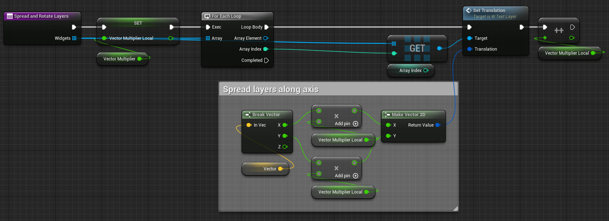
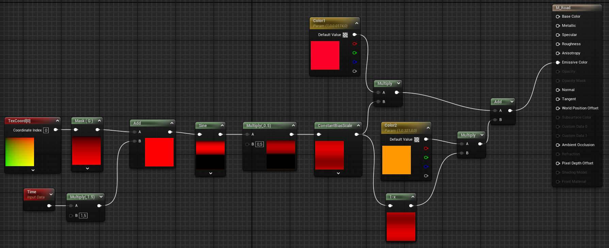

# Hotline Miami-Style Logo in Unreal Engine 5

Made with UMG. I achieved the 3D effect using several text layers that rotate around an axis at varying distances. The whole canvas also rotates around its center at varying speed, which adds to the trippy, wobbly effect.
Music is Abstract World by Alexi Action, downloaded from Pixabay

https://youtu.be/uvMZiPONfkc

Main UMG setup. The text layers are added to the overlays

I used a retainer box with a material to create the pixelated effect

The background is made out of three elements (road, sky, sun), each with a simple material that uses gradients. This is the most complex material, used for the road