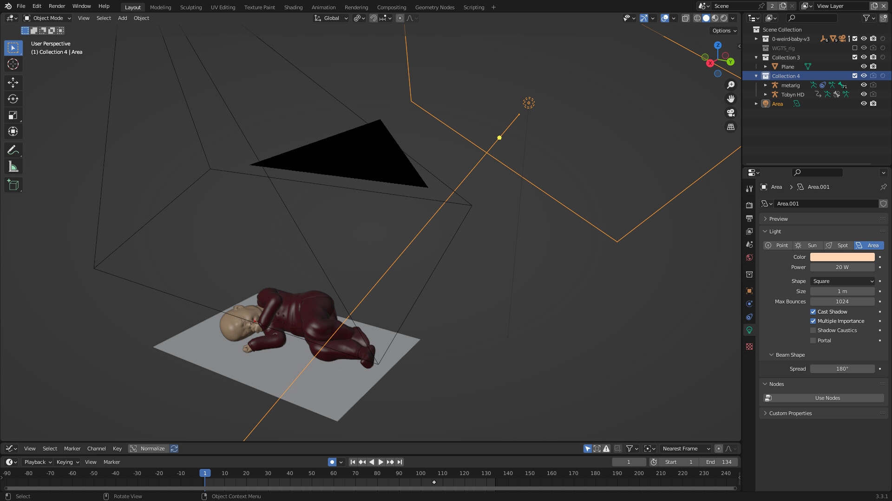
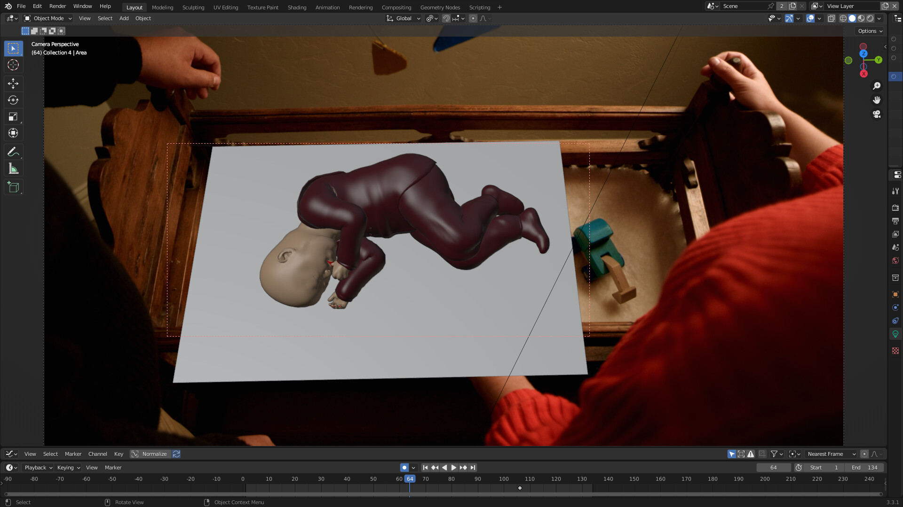

# Music Video Animation & VFX - Autumn Knows

I was responsible for creating the visual effects for a short music video: "Autumn Knows" by Freelance (https://youtu.be/cGeNgUp71YI)

A 3D model of a baby and a few animations and poses were provided through Daz Studio. I then imported these assets into Blender using the Diffeomorphic Daz Importer. It's a handy, community-made tool that works way better than the official importer add-on and I highly recommend it! Many thanks to the tool's developers, Thomas Larsson and Alessandro Padovani - you saved me a lot of headache.

I used fSpy to analyze and set up the scene. Next, I imported the baby along with the animations/poses, if needed. I used unmodified imported animations in two shots: the first scene of the baby dancing in the park and the last two scenes of the baby walking. For the other walking/dancing scenes, and the Frisbee catching shot, I modified the provided animations (the head, facial expressions and arms). I made all other animations from scratch in Blender.

I used motion tracking in a few scenes, for example the first one, where the the mother holds her baby. After adding lights and geometry, I rendered out the frames and did the rest of the work in DaVinci Resolve. That included compositing, masks (+their tracking), and color correction.

https://youtu.be/CSVaxlLsQjk

[trackingblender.mp4](trackingblender.mp4)

Tracking baby doll in Blender

[trackingdavinci.mp4](trackingdavinci.mp4)

Tracking blanket mask in DaVinci Resolve

Scene setup in Blender

Scene setup in Blender

[13-reveal-mask-davinci.mp4](13-reveal-mask-davinci.mp4)

Masking in DaVinci Resolve