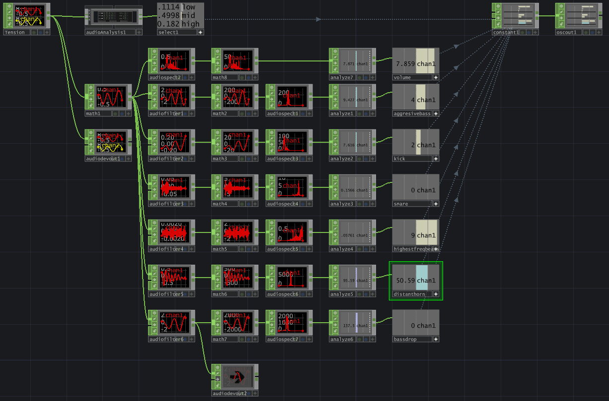
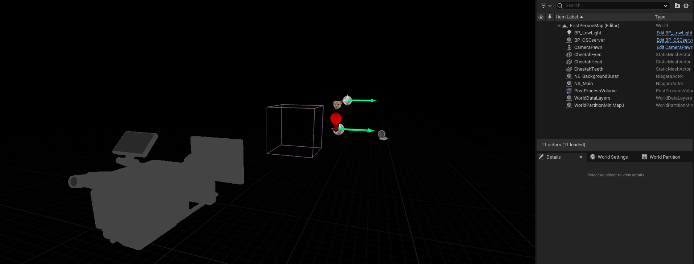
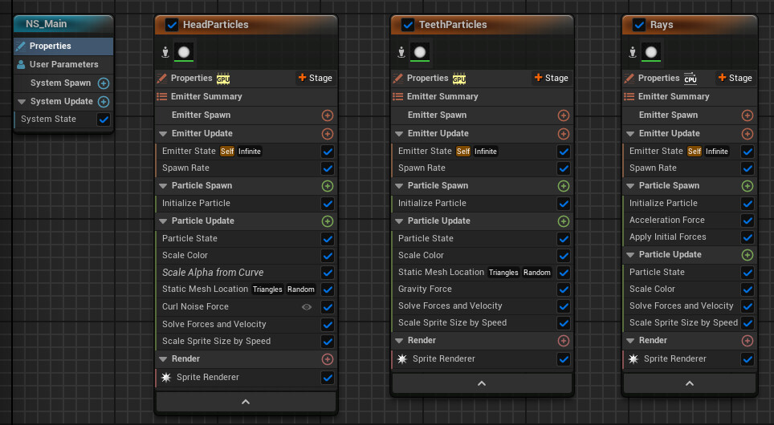
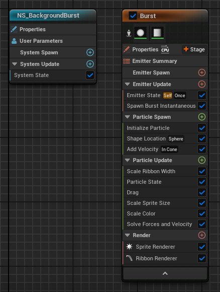
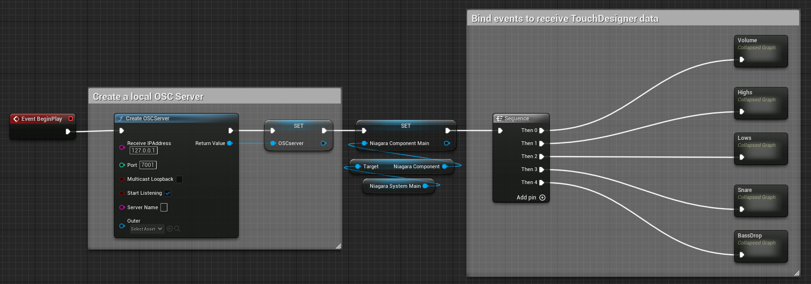

# Music Visualizer in Unreal Engine

Flicker warning! Created a music visualizer using Unreal Engine's Niagara system for the effects, TouchDesigner for analyzing the music and a local OSC (Open Sound Control) server to communicate between the two.

The color of the eyes is controlled by the bass variable fed by TouchDesigner. The light flicker is random. Other effects are controlled by a OSC server blueprint that modifies user variables in Niagara.

The song is Tension by AlexiAction. Cheetah model by hendrikReyneke (https://sketchfab.com/3d-models/cheetah-b36caff5df6148c191629c02e6fe36eb) licensed under CC BY 4.0 (https://creativecommons.org/licenses/by/4.0/)

https://youtu.be/e-0ShywEJ8A

TouchDesigner setup for analyzing music and feeding the data to Unreal Engine through a OSC server

Scene setup

Main Niagara system

Background burst Niagara system (deactivated by default and activated when a certain frequency reaches a threshold)

OSC server blueprint event graph

"Highs" collapsed graph. The other collapsed graphs works similarly