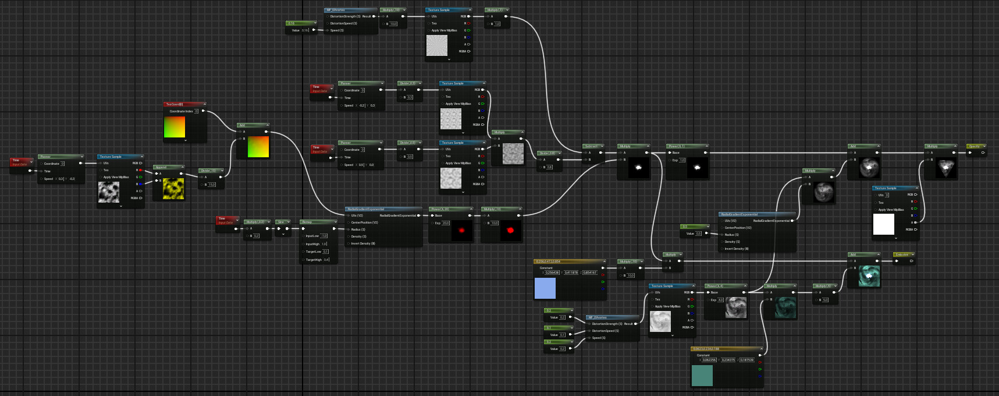
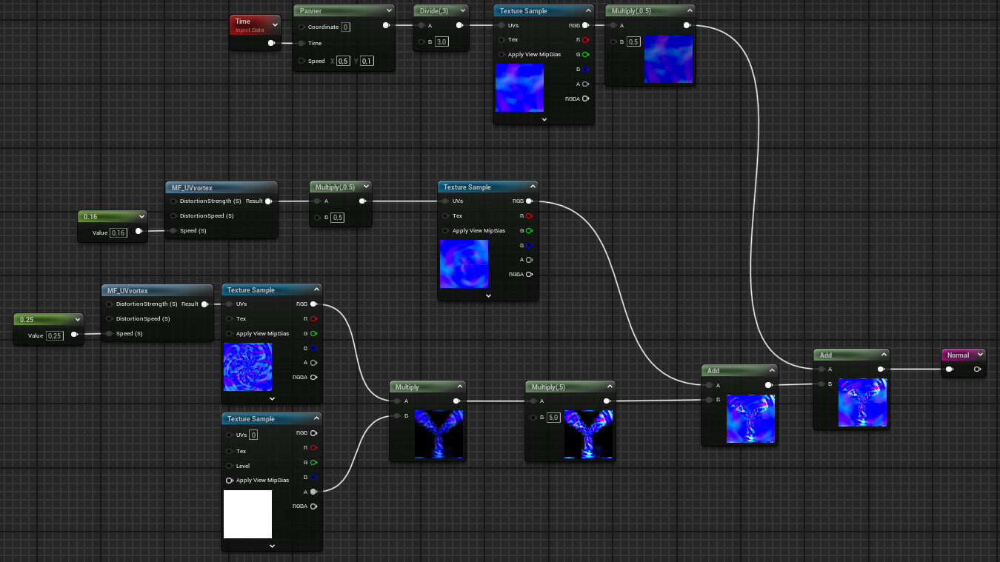
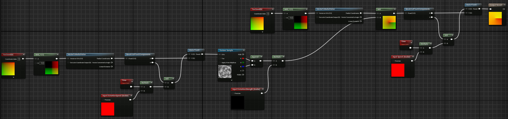
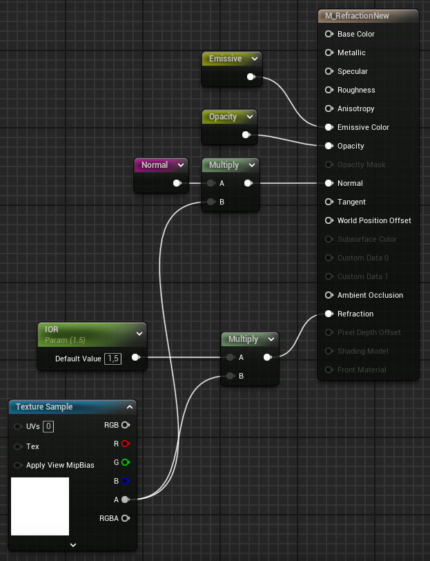
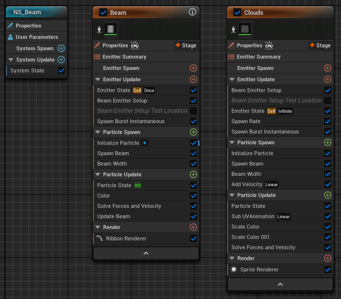

# Triangular Portal Effect - Unreal Engine 5, Niagara

The effect consists of a Niagara system for the edges of the portal (the beam and the steam/clouds it emits), as well as a plane with a material that I've built using simple noise textures and triangular masks. Changed post-process lens flares and added dirt mask. Inspired by the portal in Man of Steel (General Zod's Trial scene). Background is good ol' SM_Rock, meshes in corners are Sci-fi Props by Qwestgamp (https://skfb.ly/6WMuC) licensed under CC BY 4.0

https://youtu.be/oabDHu4Bj50

Emissive and opacity material setup

Normal maps material setup

Material function used to modify the UV coordinates and achieve the "vortex" effect

Material Setup

Niagara Setup